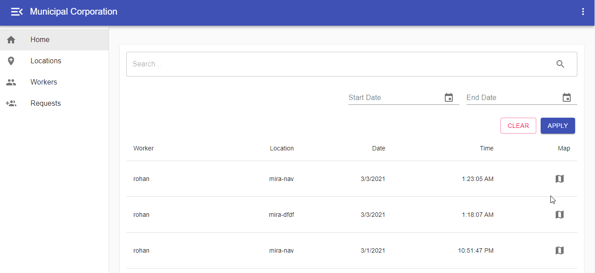

<!-- PROJECT LOGO -->
<br />
<p align="center">
  
  
  <h3 align="center">Municipal Worker Attendance System</h3>

  <p align="center">
    Marking attendance through GPS coordinates. 
    <br />
    <a href="https://github.com/rohan-mistry/Municipal-Worker-Attendance"><strong>Explore the docs »</strong></a>
    <br />
    <br />
    ·
    <a href="https://github.com/rohan-mistry/Municipal-Worker-Attendance/issues/new">Report Bug</a>
    ·
    <a href="https://github.com/rohan-mistry/Municipal-Worker-Attendance/issues/new">Request Feature</a>
	.
	<a href="https://github.com/rohan-mistry/Municipal-Worker-Attendance/tree/master/doc/screenshots">View Screenshots</a>
  </p>
</p>


<!-- ABOUT THE PROJECT -->
## About The Project

 

Municipal Corporation workers have to go onsite for their work to get completed. Municipal higher authorities are sometimes decieved by their workers in regards to false site visits and have no validation if the visit was done.

For this purpose, an attendance type system (MVP) is proposed for municipal admins and workers. Workers can mark their attendance on daily basis by uploading their location coordinates when they visit the site. Admins can verify the locations through the coordinates plotted on the map and confirm their pay status.

### Built With

* Frameworks / Libraries : [ReactJS](https://reactjs.org/), [NodeJS](https://nodejs.org/), [ExpressJS](https://expressjs.com/)
* Database : [MongoDB](https://www.mongodb.com/)


## Running from the source

Clone the repo
```sh
git clone https://github.com/rohan-mistry/Municipal-Worker-Attendance.git
```

Inside the root directory create an .env file with following keys and credentials
```sh
PORT,DB_NAME,DB_USERNAME,DB_PASSWORD,DB_URL,EMAIL_ID,EMAIL_PASSWORD,SIGN_KEY
```

Installation and Setup
- Frontend
```sh
cd client
npm install
npm start
```
- Backend
```sh
npm install
npm run dev
```

<!-- Features EXAMPLES -->
## Features

- Worker
```sh
➼ Mark attendance through GPS coordinates of the device for the alloted locations daily.
➼ See past attendance record.
➼ Edit profile options
 
```
- Municipal Admin
```sh
➼ Create locations under the jurisdiction of that Municipal Administration account.
➼ Accept / Reject incoming worker join requests. 
➼ Manage and allot locations to the verified workers.
➼ Keep a track of daily attendance marked by the workers.
```


<!-- LICENSE -->
## License

Copyright © 2021 Rohan Mistry